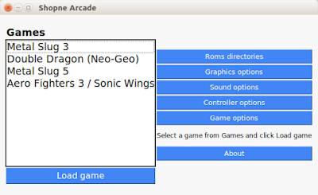
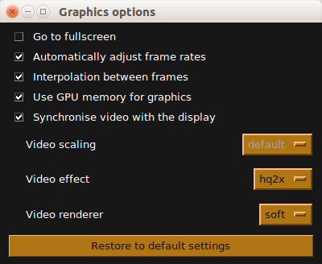
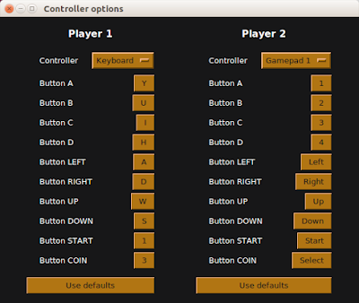
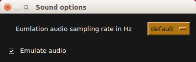
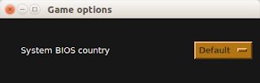

Shopne Arcade - A Frontend for GnGeo NeoGeo emulator written in Python

Copyright © 2017 Md Imam Hossain <emamhd@gmail.com> 

This program uses:

    Python TkInter for the graphical user interface 
    GnGeo for emulating Neo Geo system on PC (gngeo_bin binary file and gngeo_data.zip need to be placed inside gngeo folder of Shopne Arcade folder)

To install TKInter on Ubuntu run the following command into the terminal emulator:

sudo apt-get install python3-tk
    
Shopne Arcade is a front-end application designed to easily play Neo Geo system games on PC. It's interface is compatible for screens with low resolution such as 640x480 pixels. It lets users play Neo Geo system games from one interface where users will be able pick different game play experience settings such as Neo Geo games video resolutions, audio sampling rates, etc. Shopne Arcade is composed of pure Python language without any external dependencies making it portable across various Linux Distributions.

Neo Geo system emulation features:

    Playing games in fullscreen mode
    Automatically adjust video frame rates
    Interpolation between frames
    Use GPU memory for performance
    Synchronise video with monitor refresh rate
    Video scaling
    Video effects
    Emulating audio in different sampling rates
    Full controller configuration for keyboard and gamepads
    Support for different Neo Geo region BIOS
    Save and Load games states (state files are saved in the directory .gngeo inside users home folder)

To be able to play Neo Geo games using Shopne Arcade you need a valid Neo Geo BIOS file where the file should be put in the Neo Geo games rom files.

To launch Shopne Arcade, simply run Shopne.py file.

You can find Shopne Arcade bundled with gngeo binary packages from the following site:

https://shopnearcade.blogspot.com/
